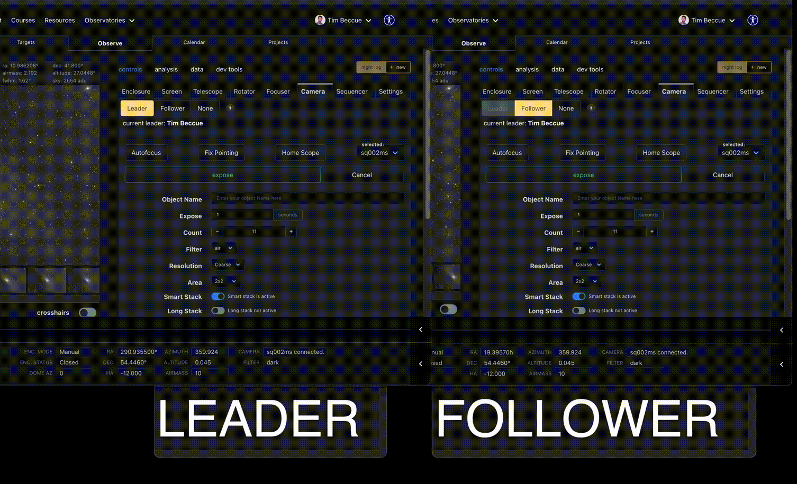

# ui-sync-server

This is a server that allows users at <www.photonranch.org> to sync their UI with others in collaborative observing sessions.
This server is built using Flask and Flask-SocketIO, and is designed to work with the Photon Ranch frontend at
<https://github.com/lcogt/ptr_ui>.

## Design Overview

Users who are running real-time observations at Photon Ranch may wish to share what they are doing with other users
who are following along. Using this server, a user at an observatory may become a "leader" or a "follower".

### Leaders

A site may have 1 leader. When a user is a leader, some of the data they input into form fields and
some UI elements they've selected (such as which tabs are visible) are sent to this server and broadcast to others.
The specifics on what information is synced is determined in the frontend logic.

### Followers

A site can have any nubmer of followers. Followers do not broadcast any information, but they recieve
information which updates their interface. When a follower or a leader first connects, a full state dump is sent to
followers. From there, any incremental changes made by a leader is sent to followers too.

Thus, followers can effectively follow along with what a leader is doing without resorting to a full blown screen
sharing solution.



## Local Development

These instructions will give you a copy of the project up and running on
your local machine for development and testing purposes. See deployment
for notes on deploying the project on a live system.

First, clone and enter the repository:

```bash
$ git clone git@github.com:LCOGT/ui-sync-server.git
$ cd ui-sync-server
```

Build the docker image

```bash
$ docker build -t ui-sync-server .
```

And run the server on port 8000

```bash
$ docker run -p 8000:8000 ui-sync-server
```

You should now be able to access the server at <http://localhost:8000>.
A quick confirmation that the server is up can be found by visiting this link in your browser
or querying with a GET request.

## Deployment

Production deployment is handled automatically with a github action that runs whenever changes are added to the main branch.

The Photon Ranch deployment uses AWS Elastic Beanstalk to manage our Docker container on an EC2 instance.
The production server is accessible at <https://uisync.photonranch.org>.

## Example Usage

Clients can connect to the server using [SocketIO](https://socket.io/).

```javascript
const websocketServerUrl = 'http://localhost:8000'
const socket = io(websocketServerUrl)
```

Start following at a site

```javascript
function startFollowerSession (socket, siteName) {
  const payload = { site: siteName }
  socket.emit('join_room', payload)
}
```

Stop following at a site

```javascript
function endFollowerSession (socket, siteName) {
  const payload = { site: siteName }
  socket.emit('leave_room', payload)
}
```

Start leading at a site

```javascript
function startLeaderSession (socket, siteName) {
  // get a full snapshot of the state we want to sync
  const fullStateSnapshot = {
    "command_params/mount_ra": 12.34,
    "command_params/mount_dec": 56.78,
    "user_interface/selected_subpage": "home",
    "user_interface/selected_target_tab": "telescope_controls"
    ...
  }
  const leader = {
    admin: false,
    name: "Firstname Lastname",
    id: "userid_1234abcd"
  } 
  const payload = JSON.stringify({
    site: siteName,
    full_state_snapshot: fullStateSnapshot,
    leader: leader
  })
  socket.emit('new_leader', payload)
}
```

Stop leading at a site

```javascript
function endLeaderSession (socket, siteName) {
  socket.emit('remove_leader', { site: siteName })
}
```

As leader, send a state update to all followers

```javascript
function updateState (socket, siteName, updatedThingName, updatedThingVal) {
  const payload = {
    site: siteName,
    mutation_name: updatedThingName,
    new_val: updatedThingVal
  }
  socket.emit('ui_change', payload)
}
```

Note: the reason the payload uses `mutation_name` for the key is because the frontend uses Vuex mutations to
identify when changes happen, and also to save incoming data for followers who recieve it. Using the name of the
Vuex mutation as the key is not only descriptive (e.g. `command_params/mount_ra`) but simplifies the state updates
by the client.

For more concrete usage examples, refer to the Photon Ranch frontend implementation at <https://github.com/LCOGT/ptr_ui/blob/dev/src/store/plugins/ui_sync.js>.
